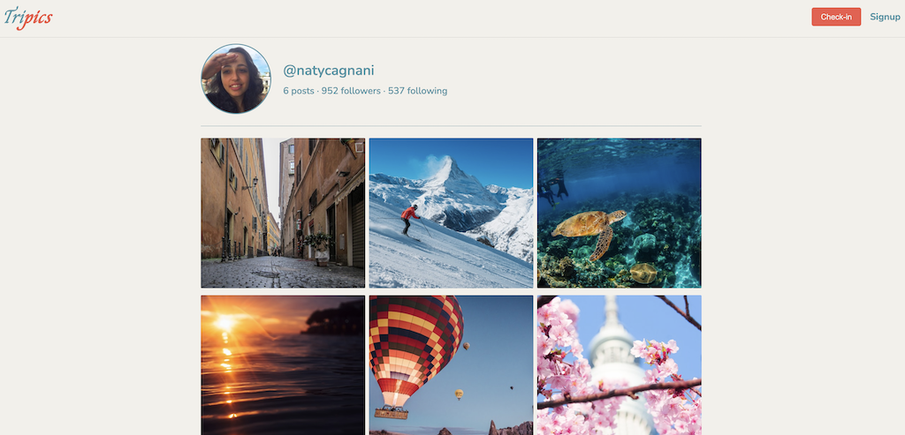

# Tripics

This front-end application integrates with a [back-end API](https://github.com/naty-c/Projeto-Tripics) developed during Imersão Dev Back-End with Alura and Google Gemini. It works similarly to a social network where everyone can share their **trip pics**. 

## Technologies

* **HTML** 
* **CSS** 
* **JavaScript** 

## Getting Started

Clone the repository:

```bash
  git clone https://github.com/naty-c/Front-Imersao-Dev.git
```

Navigate to the project directory:

```bash
  cd Front-Imersao-Dev
``` 

Install dependencies:

```bash
  npm install
``` 

Start the development server:

```bash
  npm run dev
``` 

The project will be available on http://localhost:8000

## Color Palette

| Color             | Hex                                                                |
| ----------------- | ------------------------------------------------------------------ |
| Acapulco Cliffs |  #5196A6 |
| Nano White |  #F2F0EB |
| Amour |  #F2594B |


## Sample images

### Overview



### Modal


## Appendix

This front-end was adapted from [this repository](https://github.com/guilhermeonrails/insta-like)
